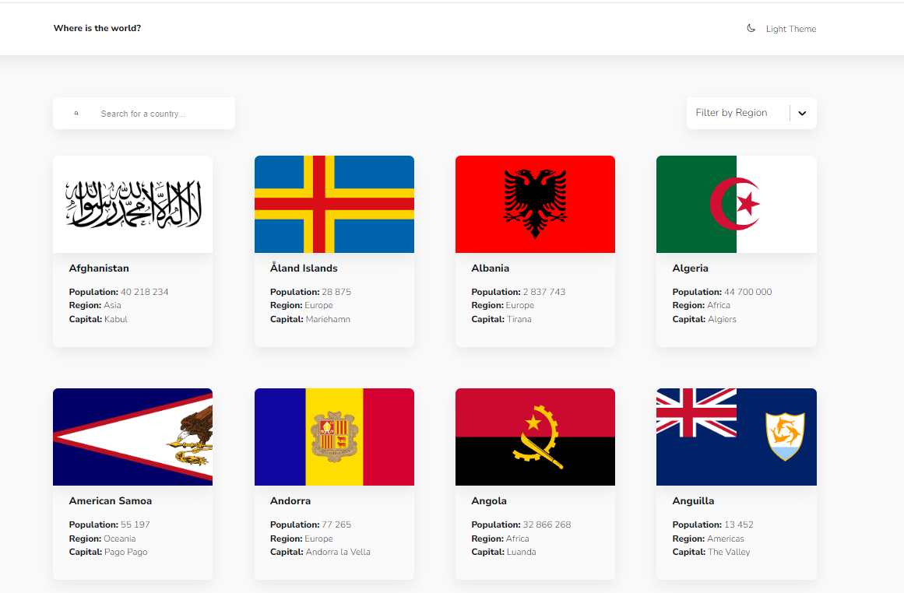

# Countries and Flags  
Countries and their flags search website  

## Website link:  

## Getting Started
In the project directory, you can run:  
<strong>  npm run start </strong>

## Functionality  
1. Countries search  
It includes:   
Search for a country 
Filter by region  

2. Country info card  
It includes:   
Core country info  
Interactive border countries list  

3. Theme changer (light to dark)  